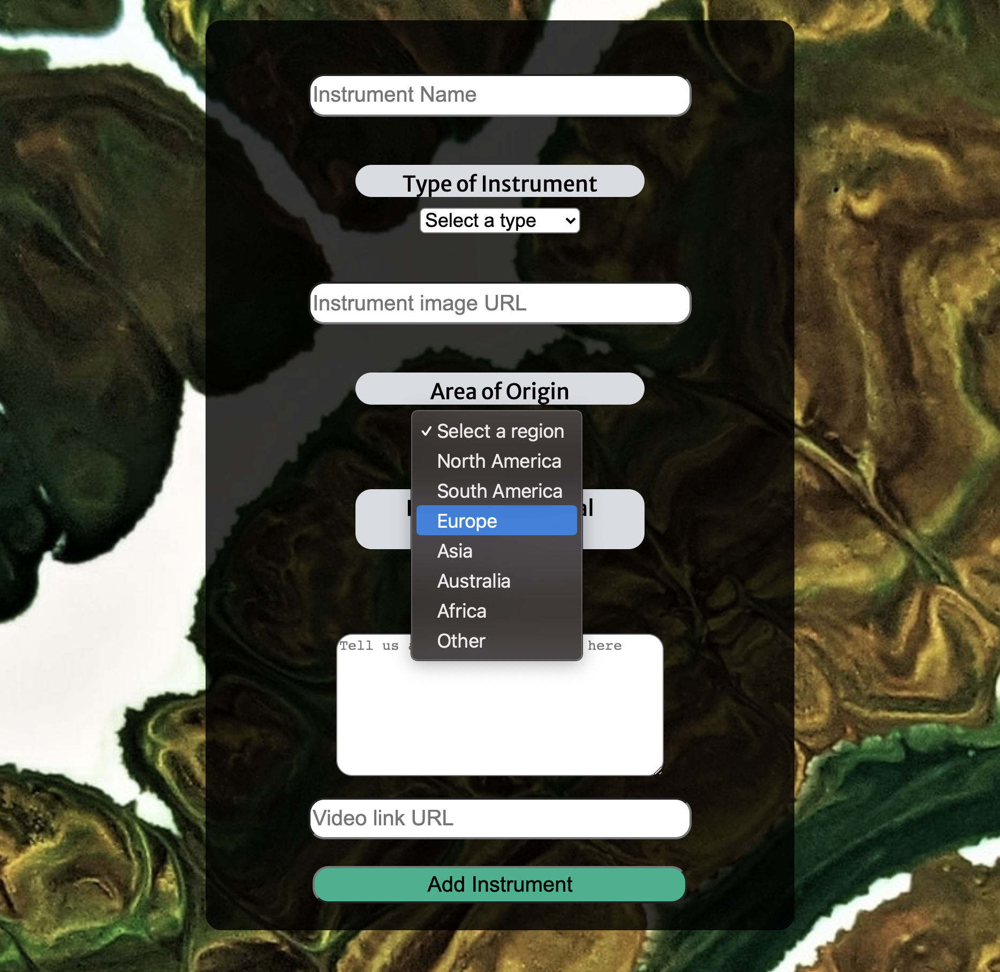
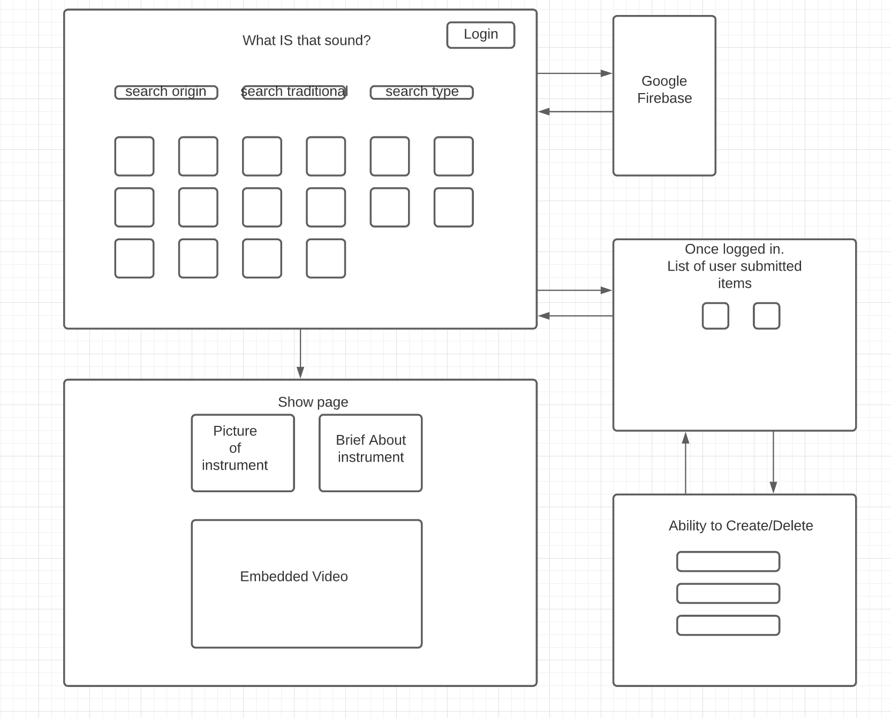
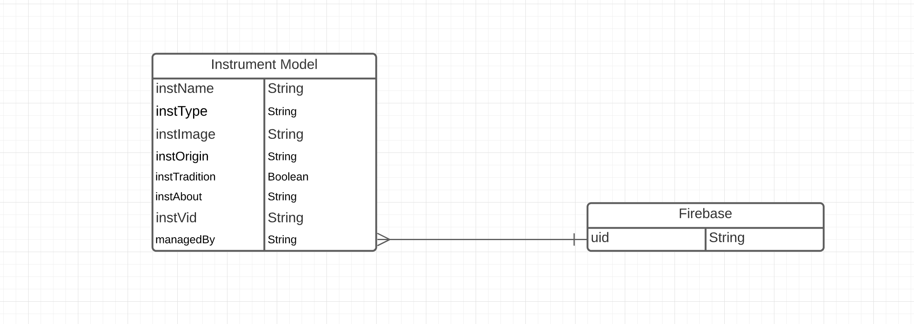

# What IS that sound?

What IS that sound is a website made for and devoted to exploring all the instruments that you may have heard but did not recognize. These instruments might be traditional to other countries, or even non traditional art installations. There are no rules as to what can or can't be added here, as long as it's an instrument that answers the main question: What IS that sound?

## This project was built with the following technologies
- HTML5
- CSS3
- Google fonts
- Javascript
- Styled-components
- Firebase
- React
- React-player
- React-router-dom
 

and relies on backend technologies that were built with

- Node js
- express
- MongoDB
- Mongoose
- Cors

### Screenshots

### See the Main website here!

https://quizzical-jepsen-f43607.netlify.app/

### Future enhancements

A filtering function that will let you be able to specific entries based on area of origin, instrument type, and traditional vs non-traditional

Pagination to break up the entries into more managable chunks, so the user doesn't have to do so much scrolling 

direct links to purchase instruments if they are available

Links to websites with more detailed information for each instrument

Give instruments tags to be able to refine filter parameters

An interactive clickable globe the be used as a search filter

